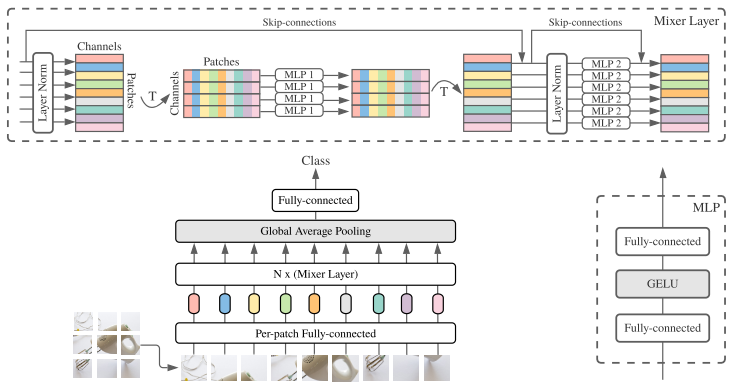
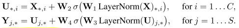
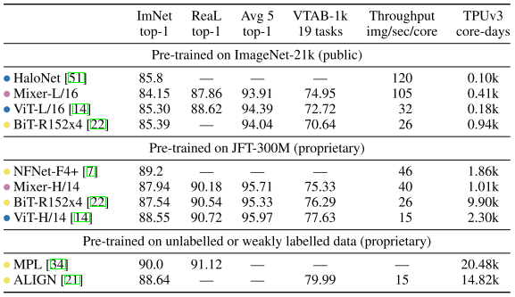
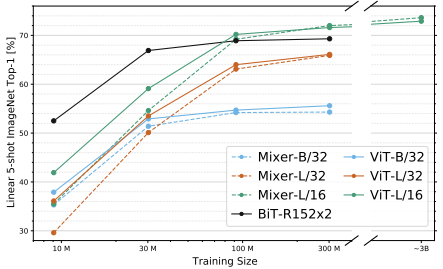
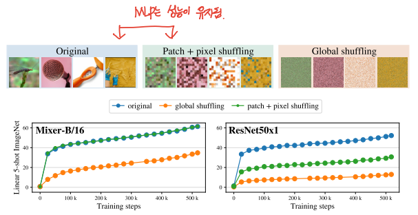
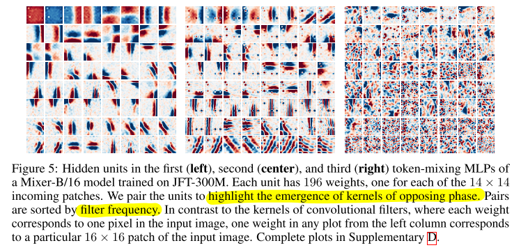

# MLP-Mixer : An all-MLP Architecture for Vision(2021-06)

## 0 Abstract

> When trained on large datasets, or with modern regularization schemes, MLP-Mixer attains competitive scores on image classification benchmarks, with pre-training and inference cost comparable to state-of-the-art models.
> 

large datasets에 modern regularization technique로 train을 하면MLP-mixer는 경쟁력있는 performance를 보여줍니다.
image classification에서, 그리고 pre-training과 inference cost에서 sota에 경쟁력 있는 모습을 보여줍니다.

// image classification외에 다른 task에서의 성능은 어떨까 궁금합니다.

## 1 Introduction

> Mixer relies only on basic matrix multiplication routines, changes to data layout (reshapes and transpositions), and scalar nonlinearities.
> 

믹스는 matmul과 data layout 변경(reshape and tranpositions), scalar 비선형성에만 의존합니다.

> In the extreme case, our architecture can be seen as a very special CNN, which uses 1×1 convolutions for channel mixing, and single-channel depth-wise convolutions of a full receptive field and parameter sharing for token mixing.
> 

극단적인 경우, 우리 아키텍처는 특별한 CNN으로 보일수 있습니다.
(1x1 conv를 체널 믹싱에 활용하고, 토큰 믹싱에 단일 체널 파라미터 sharing conv를 사용하는 특별한 CNN으로)

## 2 Mixer Architecture

> Therefore, the computational complexity of the network is linear in the number of input patches, unlike ViT whose complexity is quadratic.
> 

그러므로, computational complexity는 patches에 선형적으로 증가합니다(vit가 ^2으로 증가하는것과는 다르게)

> the overall complexity is linear in the number of pixels in the image, as for a typical CNN.
> 

전체적인 complexity는 CNN과 같이 이미지 전체의 픽셀개수에 비례하여 선형적으로 증가합니다.

> However, in separable convolutions, a different convolutional kernel is applied to each channel unlike the token-mixing MLPs in Mixer that share the same kernel (of full receptive field) for all of the channels.
> 

하지만, channel 마다 각기 다른 kernel이 apply되는 separable conv와는 다르게 token-mixing MLPs는 모든 체널에서 같은 kernel을 가집니다.

> Mixer does not use position embeddings because the token-mixing MLPs are sensitive to the order of the input tokens.
> 

믹서는 PE를 사용하지 않습니다. 왜냐하면 token-mixing은 input token의 순서에 sensitive하기 때문입니다.

// stack 순서에서 position info를 얻는다는 의미로 생각됩니다.

## 3 Experiments

> We are interested in three primary quantities: (1) Accuracy on the downstream task; (2) Total computational cost of pre-training, which is important when training the model from scratch on the upstream dataset; (3) Test-time throughput, which is important to the practitioner.
> 

우리는 세 가지 주요 수치에 관심을 가지고 있습니다.
(1) downstream task에서의 acc
(2) upstream task에서 scratch부터 시작하는 pretrain 계산비용
(3) 실무에서 중요한 test 시간 처리

> HaloNets are attention-based models that use a ResNet-like structure with local selfattention layers instead of 3×3 convolutions [51].
Big Transfer (BiT) [22] models are ResNets optimized for transfer learning. 
NFNets [7] are normalizer-free ResNets with several optimizations for ImageNet classification.
MPL is pre-trained at very large-scale on JFT-300M images, using meta-pseudo labelling from ImageNet instead of the original labels.
ALIGN pre-train image encoder and language encoder on noisy web image text pairs in a contrastive way.
> 

### 3.1 Main results

> When the size of the upstream dataset increases, Mixer’s performance improves significantly.
> 

upstream의 dataset의 사이즈가 증가할수록,
Mixer’s의 performance가 significantly하게 증가했습니다.

### 3.2 The role of the model scale

### 3.3 The role of the pre-training dataset size

> Thus, every model is pre-trained for the same number of total steps.
> 

모든 모델은 동일한 step으로 pretrain 된 결과입니다.

> When pre-trained on the smallest subset of JFT-300M, all Mixer models strongly overfit. BiT models also overfit, but to a lesser extent, possibly due to the strong inductive biases associated with the convolutions. As the dataset increases, the performance of both Mixer-L/32 and Mixer-L/16 grows faster than BiT; Mixer-L/16 keeps improving, while the BiT model plateaus.
> 

JFT-300M의 가장 작은 subset에 대해 사전 학습된 경우, 모든 믹서 모델이 강력하게 overfit합니다. BiT 모델도 overfit하지만, 컨볼루션과 관련된 강력한 inductive bias으로 인해 그 정도가 덜합니다. 
데이터 세트가 증가함에 따라 Mixer-L/32와 Mixer-L/16의 성능은 모두 BiT보다 빠르게 증가하며, Mixer-L/16은 계속 개선되는 반면 BiT 모델은 정체(plateus)됩니다.

// 왜 BiT(conv 계열)은 정체(plateus) 될까?

> It appears that Mixer benefits from the growing dataset size even more than ViT. One could speculate and explain it again with the difference in inductive biases: self-attention layers in ViT lead to certain properties of the learned functions that are less compatible with the true underlying distribution than those discovered with Mixer architecture.
> 

Mixer는 ViT보다 데이터 세트 크기가 커질수록 더 많은 이점을 얻는 것으로 보입니다. inductive bias의 차이로 다시 한 번 추측하고 설명할 수 있습니다. ViT의 MSAs은 학습된 함수의 특정 속성(certain properties)을 실제 기본 분포와 덜 호환되는 Mixer 아키텍처에서 발견되는 것보다 더 많이 유도합니다.

// weak inductive bias(MLP)의 경우 huge dataset에서 더 좋은 성능을 발휘할 것 이라는 말로 생각됩니다.

### 3.4 Invariance to input permutations

> As could be expected, Mixer is invariant to the order of patches and pixels within the patches (the blue and green curves match perfectly). On the other hand, ResNet’s strong inductive bias relies on a particular order of pixels within an image and its performance drops significantly when the patches are permuted. Remarkably, when globally permuting the pixels, Mixer’s performance drops much less (∼45% drop) compared to the ResNet (∼75% drop).
> 

// global shuffling은 mixer의 performance도 크게 하락시켰습니다.
conv에 patch개념을 넣은것은 inductive bias를 줄여준 것이 
아닐까요?

### 3.5 Visualization

> It is commonly observed that the first layers of CNNs tend to learn Gabor-like detectors that act on pixels in local regions of the image. In contrast, Mixer allows for global information exchange in the token-mixing MLPs, which begs the question whether it processes information in a similar fashion.
> 

일반적으로 CNN의 첫 번째 레이어는 이미지의 로컬 영역에 있는 픽셀에 작용하는 가버와 유사한 검출기를 학습하는 경향이 있습니다. 이와는 대조적으로 믹서는 토큰 혼합 MLP에서 글로벌 정보 교환을 허용하므로 유사한 방식으로 정보를 처리하는지 의문이 생깁니다.

Recall that the token-mixing MLPs allow global communication between different spatial locations.

토큰 혼합 MLP를 사용하면 서로 다른 공간 위치 간의 글로벌 통신이 가능하다는 점을 기억하세요.

## 4 Related work

> Many recent works strive to design more effective architectures for vision. Srinivas et al. [42] replace 3×3 convolutions in ResNets by self-attention layers. Ramachandran et al. [37], Tay et al. [47], Li et al. [26], and Bello [3] design networks with new attention-like mechanisms. Mixer can be seen as a step in an orthogonal direction, without reliance on locality bias and attention mechanisms.
[3]: Modeling long-range interactions without attention.(2021)
[26]: Involution: Inverting the inherence of convolution for visual recognition.(2021)
[37]: Stand-alone self-attention in vision models.(2019)
[47]: Synthesizer: Rethinking self-attention in transformer models. (2020)
> 

## 5 Conclusions

> On the theoretical side, we would like to understand the inductive biases hidden in these various features and eventually their role in generalization.
> 

## reference(DSBA)

IB에 대해 디테일하게 설명해 주는 영상입니다.

MLP에서 Inductive Bias를 줄여주자는 발생입니다.

<aside>
💡 Inductive Bias

Inductive Bias는 “일반화를 위해 미리 경향성을 구조적으로 강제”해주는 것입니다.

in the absence of string i.b., a model can be equally attracted to several local minima on the loss surface; and the converged solution can be arbitarily affected by random variations like the initial state of the order of training examples. [[ref](https://arxiv.org/abs/2006.00555)]

// i.b.가 없으면 local minima에 수렴하게 됩니다.

</aside>

<aside>
💡 No free lunch Theorems

There is no such model that fits all possible situation

// 상황마다 가장 fit한 모델은 다릅니다.

</aside>

[[Paper Review] MLP-Mixer: An all-MLP Architecture for Vision](https://youtu.be/Y-isY31Thkw)