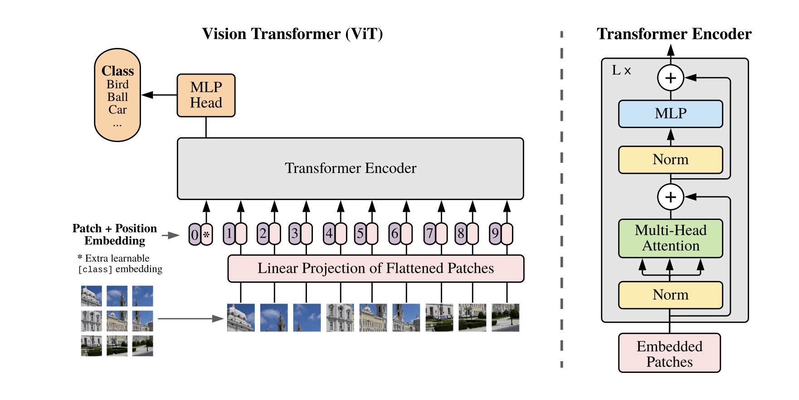
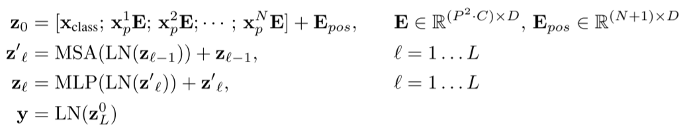
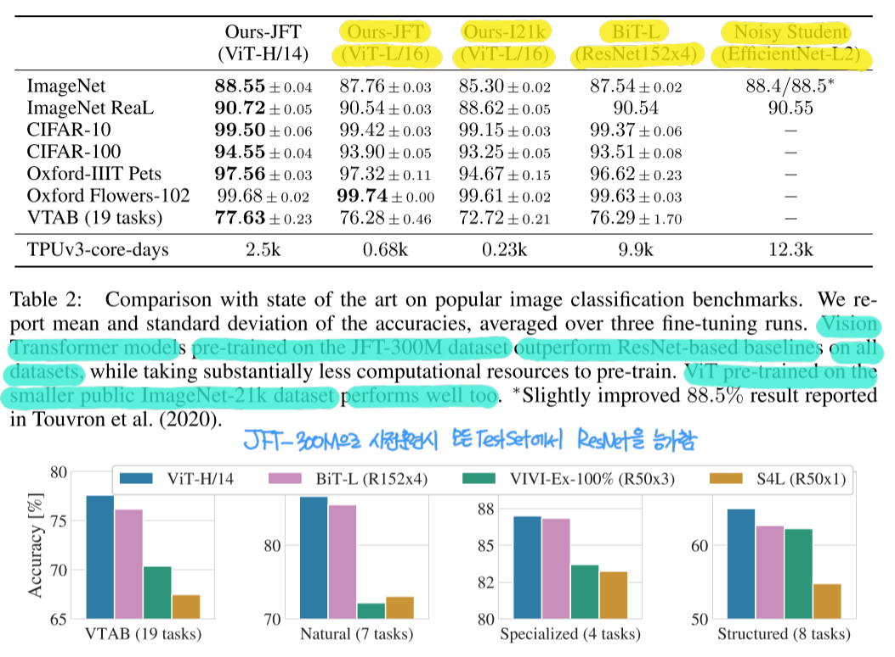
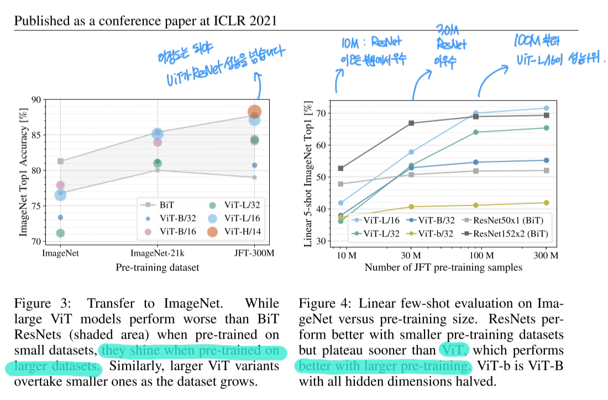
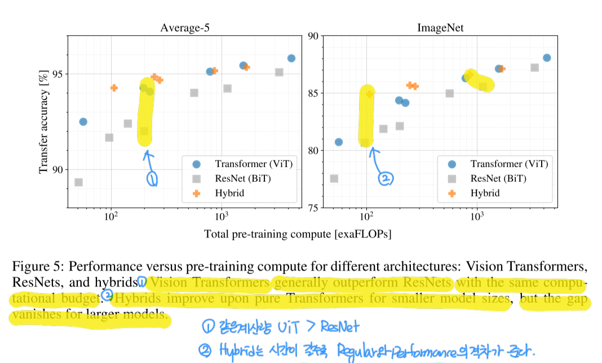
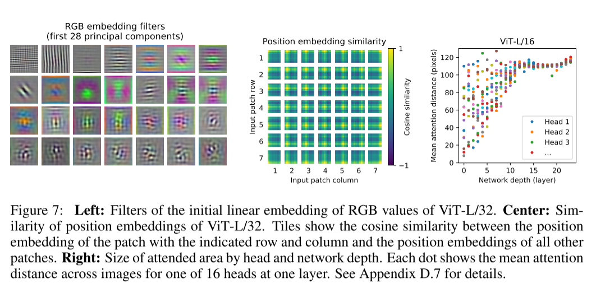

# An Image is Worth 16x16 Words: Transformers for Image Recognition at Scale(2020-10)

[https://arxiv.org/abs/2010.11929](https://arxiv.org/abs/2010.11929)

## ABSTRACT

ViT는 트랜스포머 기반의 아키텍처입니다. large data로 training하고 mid, small size의 이미지에 transfer할 경우 SOTA의 성능을 보여줍니다.  
또한 훈련시 컴퓨터 자원을 CNN 구조에 비해 덜 필요로 합니다.

## INTRODUCTION

NLP에서 셀프 어탠션 기반의 트랜스포머는 현재 지배적인 모델이 되었습니다.
트랜스포머는 컴퓨터 연산도 효율적이고 확장도 가능합니다.  

이전의 구조들보다 파라미터가 매우 많고 데이터셋과 모델의 사이즈를 증가시키면  
Saturation없이 성능 향상 보여줍니다.

하지만, Computer Vision 영역에서는 아직 CNN 구조가 지배적인 모델입니다.  
NLP의 성공에 영감을 얻어 CNN과 Self-Attn을 결합하려는 시도가 여럿 있었습니다.  
하지만, 이론상의 효율성과는 반대로 어탠션 패턴의 특이성으로 인해 현대 하드웨어로는 감당이 불가능했습니다. 때문에 Large resolution의 영역에서는 아직 ResNet구조의 아키텍처가 SOTA 위치를 차지고 있습니다.

저자들은 최소 조정만하여 바닐라 트랜스포머의 구조를 컴퓨터 비전에 이용했습니다.  
이미지를 패치 단위로 쪼개고, 이것들을 리니어 임배딩하여 트랜스포머의 입력으로 사용했습니다.  
입력 패치들은 NLP분야에서 token과 같은 개념으로 사용되습니다, 그리고 이를 지도학습의 Image Classification에 도입하였습니다.

mid-size 데이터셋(like ImageNet)으로 regularization없이 trained ViT는 ResNet보다 약간 성능이 부족했습니다.  
왜냐하면 트렌스포머는 CNN에 대비해서 [Inductive Bias](./vit/vit0.png)가 부족하기 때문에(like, translation equivariance and locality) 트레인시 데이터의 양이 불충분하여 generalize가 덜 되었기 떄문입니다.

하지만, Large 데이터셋으로 모델 Training시 Inductive Bias를 능가하는 것을 확인할 수 있습니다.
ImageNet-21K 혹은 JFT-300M로 Training된 ViT는 ImageNet : 90.72%, ImageNet-ReaL : 94.55%, CIFAR-100 : 77.63%의 성능을 달성했습니다.

## RELATED WORK

Transformer를 Computer Vision에 적용하려는 많은 연구가 있었으며 좋은 결과(Promising result)를 보여주었습니다.  
하지만, Attention architecture는 이미지 resolution의 증가에 따라 quadratic으로 cost도 같이 증가하여, 적용이 어려웠습니다.  
때문에 local neighborhoods에 한하여 attention을 적용하는 등 다양한 방법으로 접근방법이 연구되었습니다.  
[Cordonnier(2020)](https://arxiv.org/abs/1911.03584)에서는 2X2 패치 사이즈로 self-attention을 적용하는 모델을 연구했습니다.
ViT는 이 모델의 방법에 영향을 받았고 더 나아가 pre-training, vanila transformer를 적용하면 CNN을 능가한다는 점을 보여주었으며 Large Resolution에도 적용가능한 방법을 제안했습니다.

또한 CNN와 self-attention의 결합에도 최근에 관심이 많습니다.

## METHOD



```python
# [class] embedding
if classifier == 'token':
		self.class_token = nn.Parameter(torch.zeros(1,1,dim))
		seq_len += 1
```



### VISION TRANSFORMER(ViT)

① 이미지를 잘라 Patch를 만들고, 패치를 Flatten합니다.

② Flatten Patches를 Linear Projection하여 차원을 축소 시킵니다.

③ Projected Patches에 [class token]을 붙이고 Position Embedding 합니다.

④ Embedded Patches를 Transformer Encoder에 넣어 Patches를 representation 합니다.

⑤ representation된 첫번째 token(=class token)을 떼어내 MLP를 통과시켜 classifying 합니다.

### NLP Transformer와의 차이점

- Positional Embedding은 이미지의 특성을 반영하여 2차원 임배딩합니다.
    - 이는 self-attention에는 CNN과 같은 Inductive bias가 없기 때문입니다.
    2D의 neighborhood 정보를 주어 2D position imformation을 제공합니다.
- Transformer Encoder Block의 Activation Function은 GELU를 사용합니다.
- Layer norm을 적용 하여 Patch단위의 Normalization을 적용 합니다.

### Hybrid Architecture

단순히 raw image에 ViT를 적용하지 않고 CNN을 통해 만들어진 feature map에 ViT아키텍처를 적용한 실험도 추가하였습니다.

### FINE-TUNING AND HIGHER RESOLUTION

Large dataset에서 pre-train하고 downstream task에 fine-tune했습니다.  
이때 마지막에서 MLP구조를 제거하고 downstream tasks에 맞는 MLP layer를 적용했습니다.

## EXPERIMENTS

Pretrain datasets의 사이즈를 달리하면서 ResNet, ViT, Hybrid(ViT)를 실험하였습니다.

### COMPARISON TO SOTA

ⓐ ViT-H/14 : Huge dataset 사전훈련, 패치 사이즈 14
ⓑ ViT-L/16  : Large dataset 사전훈련, 패치 사이즈 16
ⓒ Big Transfer(BiT) : Large ResNets을 전이학습 시킨 모델
ⓓ Noisy Student : Large EfficientNet



JFT-300M으로 사전훈련된 모델들 ViT-L/16, BiT-L, Noisy Student 모델 중 ViT모델이 가장 좋은 성능을 보였습니다, 또한 사전 학습량이 CNN 대비 매우 작았습니다.

### PRE-TRAINING DATA REQUIREMENTS



(LEFT) 데이터셋의 사이즈가 커질수록 ViT가 CNN보다 성능이 잘나옵니다.
(RIGHT) ResNet은 Saturation을 보이는 반면, ViT는 데이터셋이 커져도 일정 수준까지 성능이 비례하여 향상됩니다.



동일한 퍼포먼스에서 ViT의 연산량이 더 적습니다.
Hybrid모델은 적은 데이터에서는 성능이 더 좋으나 사이즈가 커질수록 ViT와의 갭이 적어집니다.

### SELF-SUPERVISION



(LEFT) 임배딩시 사용된 리니어 필터 시각화의 이미지 입니다. CNN의 초기 필터 형상과 유사합니다.
(CTR) 2D 포지셔널 인코딩의 시각화 형상입니다.
(RIGHT)  쿼리 패치와 다른 패치들 간의 평균 어텐션 유사도(거리) 얕은 레이어는 다양한 영역에서 유사도가 계산됩니다, 깊은 레이어에서는 모든헤드가 글로벌한 영역에서의 유사도를 계산합니다.